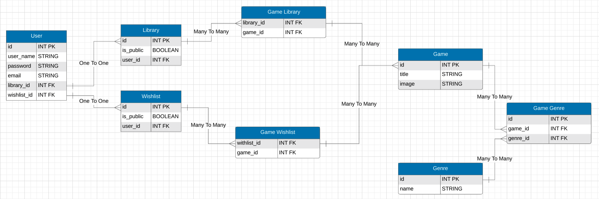
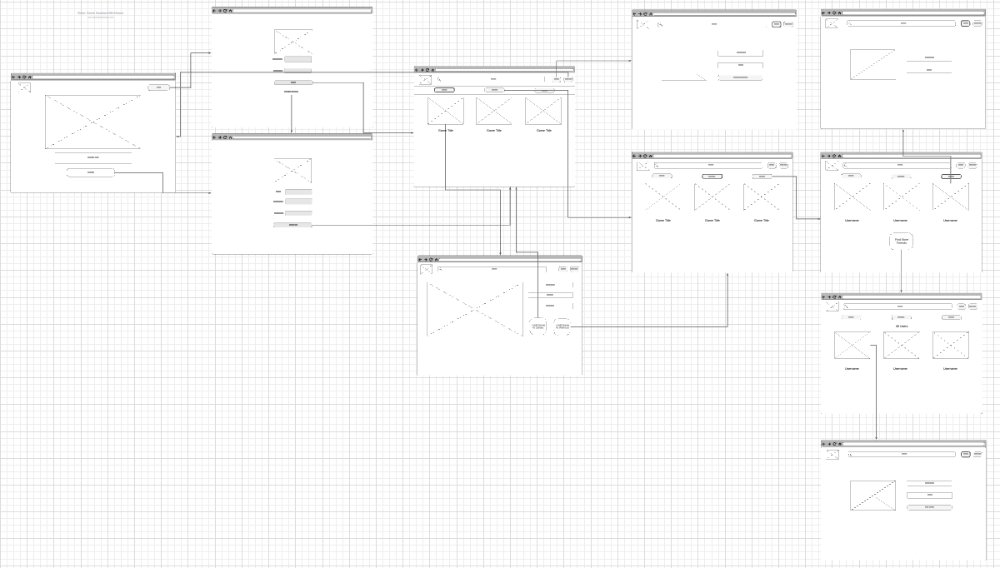

# Video Game Database

  

  ## User Story
  User wants to create a database that can keep track of the games they have played, they are currently playing, and wish to play/buy.
  
  User  will be given a search form where they can enter a game's title and are brought to that games page.

  On the games page the user can choose to add the game to their library or wish list. The user can then view all of the games that they have added to their library or wish list.

  [Link to deployed application](https://vast-lake-35863.herokuapp.com/)

  ## Table of Contents
  - [Design](#design)
  - [Technologies](#technologies)
  - [Installation](#installation)
  - [Usage](#usage)
  - [Credits](#credits)
  - [License](#license)
  - [Contributing](#contributing)
  - [Tests](#tests)
  - [Questions](#questions)

  ## Design
  The app follows the MVC paradigm in its architectural structure, using Handlebars.js as the templating language, Sequelize as the ORM, and the express-session npm package for authentication.

  Here is an ERD we created to structure the database.

  

  Here is a wire frame we created to structure each page.

  

  ## Technologies
  Project is created with 
  * [Javascript](https://www.javascript.com/)
  * [Node.js](https://nodejs.org/en/)
  * [Sequelize](https://www.npmjs.com/package/sequelize)
  * [MySQL2](https://www.npmjs.com/package/mysql2)
  * [Axios](https://axios-http.com)
  * [Express](https://www.npmjs.com/package/express)
  * [Dotenv](https://www.npmjs.com/package/dotenv)
  * [connect-session-sequelize](https://www.npmjs.com/package/connect-session-sequelize)
  * [Express-Handlebars](https://www.npmjs.com/package/express-handlebars)
  * [bcrypt](https://www.npmjs.com/package/bcrypt)

  ## Installation 
  Use git clone to clone the repository on your local machine and then run npm i

  ## Usage 
  run npm start then open a web browser to http://localhost:3001/

  ## Credits 
  Sean Craig,
  Dylan Dimayuga,
  Olha Myndziv

  ## License 
  [License MIT](https://opensource.org/licenses/MIT)

  ## Contributing
  Pull requests are welcome. For major changes, please open an issue first to discuss what you would like to change.

  ## Tests
  There are currently no tests

  ## Questions
  If you have any questions about this project please send an email to any of use on the development team:
    Sean: seancraig21@gmail.com 
    Dylan: kuyadylan@gmail.com
    Olha: olyaosiychuk@gmail.com
  
  Or reach out to any of use on Github:
    Sean: seanscraig
    Dylan: kuyadylan
    Olha: OlhaMyndziv